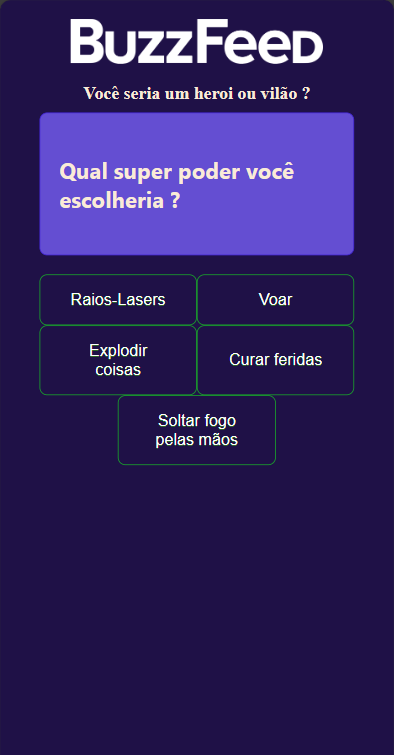

# Buzzfeed Quiz using Angular

This project is a quiz in the classic Buzzfeed style  built along a DIO course [FrontEnd Development with Angular](https://www.dio.me/bootcamp/coding-future-banco-pan-desenvolvimento-frontend-com-angular).

It's a quiz with several questions that returns a results depending on the answers.

## Ferramentas utilizadas

- Angular
- npm
- Typescript
- CSS
- HTML5

## Funcionalidades

- Layout responsivo.

## Demonstração

